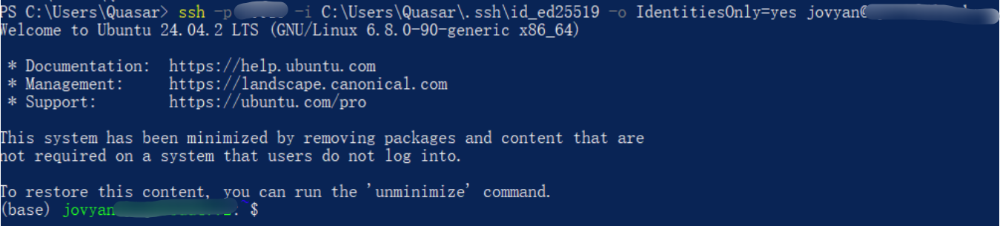

# ssh服务器免Token登录 #
1. SSH连接服务器，生成本地私钥
在windows的powershell（管理员身份）中输入命令“ssh-keygen”
2. 将本地公钥加到服务器端
在本地找到刚刚生成的公钥，用Vscode打开复制公钥，路径一般为：type C:\Users\Quasar\.ssh\id_ed25519.pub
会输出一整行类似：ssh-ed25519 AAAAC3Nza... Quasar@PC
==或者==管理员身份运行本地Powershell，执行：type C:\Users\Quasar\.ssh\id_ed25519.pub
会输出一整行类似：ssh-ed25519 AAAAC3Nza... Quasar@PC   亦可
3. 在Vscode远程终端将公钥写入服务器
正常输入Token链接SSH服务器后，打开终端（Ctrl + ~）
在远程终端执行：
mkdir -p ~/.ssh
chmod 700 ~/.ssh
nano ~/.ssh/authorized_keys
然后把前面你的公钥“ssh-ed25519 AAAAC3Nza... Quasar@PC”粘贴进去，保存，Ctrl+X退出
确认是否成功添加，执行：
echo $HOME
ls -la ~/.ssh
确保加入的是/home/jovyan/.ssh/authorized_keys目录
4. 回到本地Powershell，执行：
ssh -p 40019 -i C:\Users\Quasar\.ssh\id_ed25519 -o IdentitiesOnly=yes jovyan@(你的服务器ip)

成功！